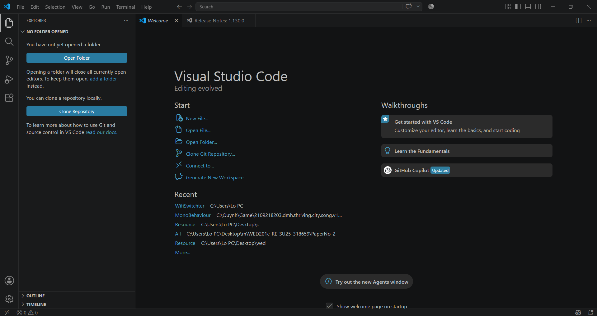

# BÁO CÁO THỰC HÀNH: TÌM HIỂU VÀ TRẢI NGHIỆM CÔNG VIỆC TESTER

## PHẦN 1: TÌM HIỂU VỀ NGHỀ TESTER (KIỂM THỬ PHẦN MỀM)

### 1. Tester là gì?
Tester (nhân viên kiểm thử phần mềm) là những người chịu trách nhiệm kiểm tra, tìm kiếm các lỗi (bug) hoặc những điểm chưa hoàn thiện của một phần mềm, ứng dụng hay trang web trước khi nó được giao cho khách hàng hoặc tung ra thị trường. Mục tiêu cuối cùng của Tester là đảm bảo chất lượng sản phẩm tốt nhất.

### 2. Công việc của một Tester
* **Đọc hiểu tài liệu:** Nghiên cứu tài liệu mô tả yêu cầu của dự án để hiểu phần mềm cần phải làm được những gì.
* **Lập kế hoạch và Viết Test Case:** Lên kịch bản các trường hợp cần kiểm tra (Ví dụ: Nhập sai mật khẩu thì web báo lỗi thế nào, có thông báo rõ ràng không?).
* **Thực thi kiểm thử (Execute Test):** Trực tiếp thao tác trên phần mềm (đóng vai trò như một người dùng thật) để chạy các Test Case đã viết.
* **Báo cáo lỗi (Log Bug):** Ghi nhận lại các lỗi tìm thấy lên hệ thống quản lý, chụp ảnh/quay video màn hình làm bằng chứng và gửi cho Lập trình viên (Developer) để sửa chữa.
* **Kiểm tra lại (Re-test):** Sau khi Developer báo đã sửa xong, Tester sẽ kiểm tra lại một lần nữa xem lỗi đó đã thực sự biến mất chưa.

### 3. Kỹ năng cần thiết
* **Kỹ năng chuyên môn:** Hiểu biết về quy trình phát triển phần mềm (SDLC), tư duy logic tốt để bao quát hết các trường hợp có thể xảy ra, biết sử dụng các công cụ quản lý lỗi (như Jira, Trello).
* **Kỹ năng mềm:** Tính cẩn thận, cực kỳ tỉ mỉ; kỹ năng giao tiếp khéo léo để tranh luận và trao đổi công việc hiệu quả với đội ngũ lập trình.

---

## PHẦN 2: THỰC THI KIỂM TRA HỆ THỐNG MEDAIVN.COM

**Mục tiêu:** Đóng vai trò là một người dùng, thực hiện kiểm tra giao diện và một số chức năng cơ bản trên trang web `medaivn.com`.

### Bảng kết quả kiểm tra (Test Cases)

| STT | Chức năng kiểm tra | Các bước thực hiện | Kết quả mong đợi | Kết quả thực tế | Trạng thái |
|---|---|---|---|---|---|
| 1 | **Giao diện trang chủ** | Truy cập `medaivn.com` và cuộn từ trên xuống dưới. | Hình ảnh hiển thị rõ nét, không bị méo, font chữ đồng nhất, các nút bấm xếp ngay ngắn. | Web load nhanh, hình ảnh hiển thị bình thường, giao diện mượt mà. | **Pass** (Đạt) |
| 2 | **Chuyển hướng Menu** | Bấm vào một mục bất kỳ trên thanh Menu chính. | Web chuyển sang đúng trang tương ứng, đường link trên trình duyệt thay đổi đúng. | Chuyển đúng trang, không bị lỗi 404 (Không tìm thấy trang). | **Pass** (Đạt) |
| 3 | **Chức năng Tìm kiếm** | Nhập ký tự đặc biệt (VD: `!@#$%`) vào ô tìm kiếm và ấn Enter. | Web hiển thị thông báo "Không tìm thấy dược liệu" rõ ràng, không bị sập (crash). | Web trả về trang trống hoặc có thông báo, hoạt động ổn định. | **Pass** (Đạt) |
| 4 | **Logo trang chủ** | Khi đang ở một bài viết phụ, bấm vào Logo ở góc trái trên cùng. | Trình duyệt phải ngay lập tức chuyển hướng về lại Trang chủ. | Bấm vào logo thì web load lại về đúng trang chủ. | **Pass** (Đạt) |
| 5 | **Nút tương tác / Form** | Kéo xuống cuối trang, tìm các nút bấm chuyển trang hoặc Form điền thông tin. | Nút bấm có thể click được, form cho phép nhập chữ. | Các nút chuyển trang hoạt động trơn tru, mượt mà | **Pass** (Đạt) |

---

## PHẦN 3: MINH CHỨNG THỰC HIỆN BÀI TẬP

**1. Minh chứng đã tạo tài khoản GITHUB thành công:**

**2. Minh chứng đã cài đặt thành công phần mềm VS Code:**

**3. Minh chứng thực thi test trên medaivn.com:**
